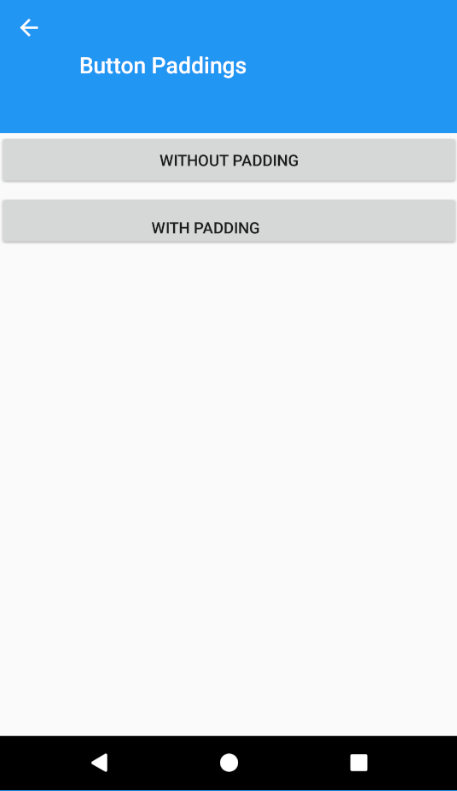
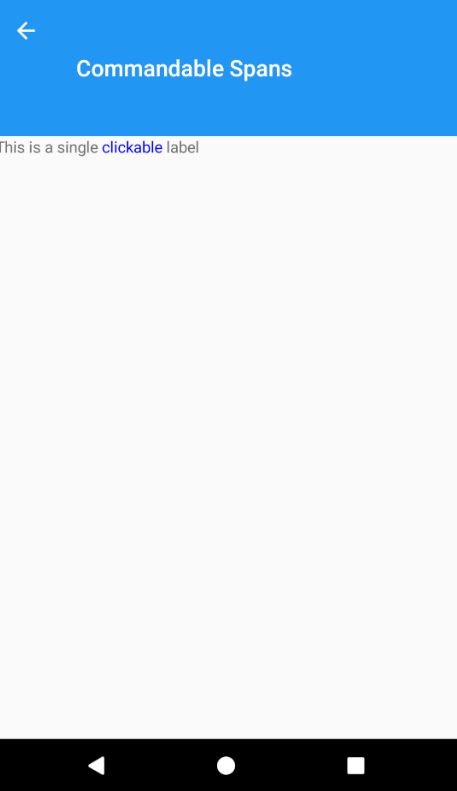
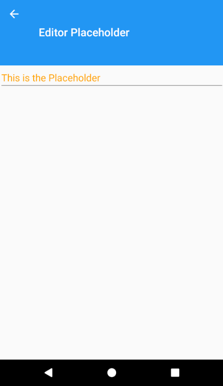
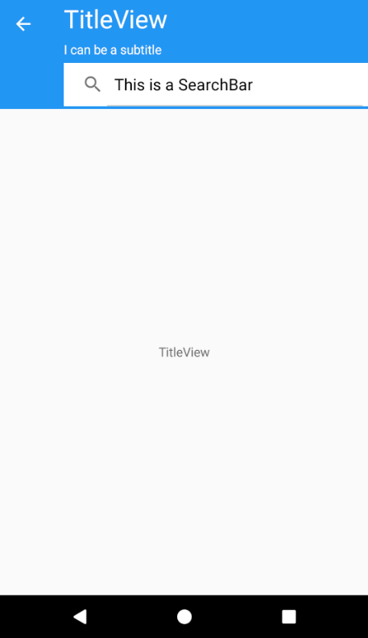
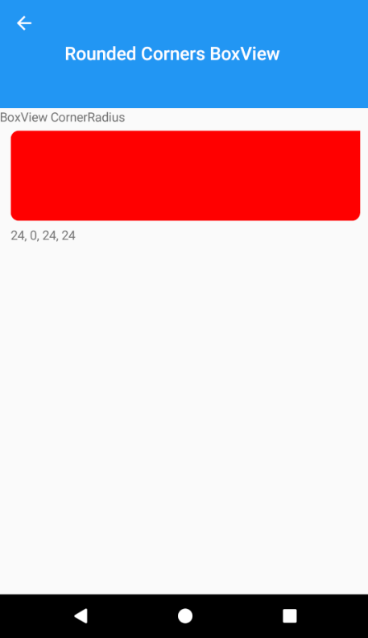

# ThreeTwoPlayground

**Xamarin.Forms** sample to show the main features of **3.2** version.

The sample is available for three platforms:

- iOS
- Android
- Universal Windows Platform (UWP)

## Screenshots

    

## Requirements

* [Visual Studio 2017 version 15.3 or Visual Studio for Mac version 7.3](https://www.visualstudio.com/vs/)

## Copyright and license

Code released under the [MIT license](https://opensource.org/licenses/MIT).